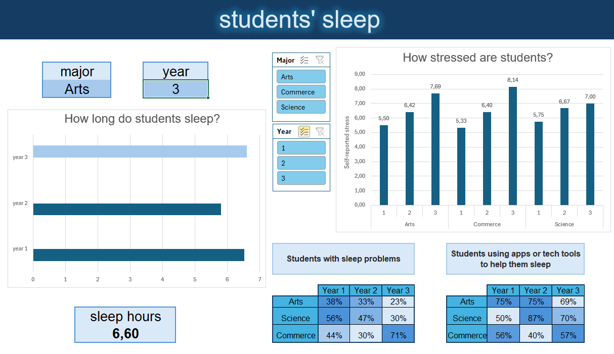

# 😴 Analysis of students' sleep

This project presents an analysis of sleep patterns among university students, examining the impact of factors such as sleep duration, stress levels, and technology use. The analysis is based on a dataset of 100 students from three fields of study (arts, sciences, business) over three academic years. You can see the finished dashboard [here](files/sleep_student_dasboard).

## Objectives

* Identify the correlation between sleep duration and perceived stress.

* Examine the prevalence of sleep problems and the use of sleep-enhancing technologies.

* Check whether the use of sleep-enhancing technologies reduces the incidence of sleep problems.

* Examine which fields of study and years of study students are most stressed about and whether sleep duration has an impact on this.

## Dataset

The dataset used in this analysis is publicly available on Kaggle: 
[Simulated Student Sleep Dataset](https://www.kaggle.com/datasets/valencaycodes/simulated-student-sleep-dataset)

## Technical Implementation

* Power Query for data cleaning and transformation

* Conditional formulas (`COUNTIFS`, `AVERAGEIFS`) for segmented analysis

* `XLOOKUP` for data retrieval and dynamic integration with the dashboard

* Dynamic calculations based on major and year filters

* Data validation and structured references for maintainability

* Dashboard consolidation for executive reporting

## Dashboard

This interactive dashboard analyzes the sleep health and stress levels of university students across different majors and academic years. It provides a clear, visual summary of key patterns and trends.

### Filter by Major and academic year

Use this filter to check the average length of sleep for students in a selected year and field of study.

Use the Major and Year filters to select a student group. The radar chart will instantly update to show their average stress levels compared to other groups.

